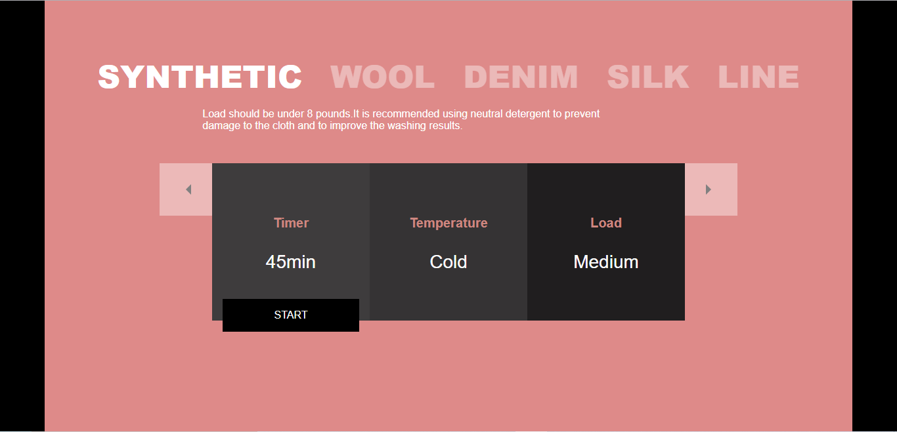

# loop2step1
*An implementation of Material Selection and Conditions with HTML/CSS*

## Getting Started
Clone or download this repository and run with a local server of open `index.html` with your favorite browser

## Prequisite
- Your browser version must be recent for a better experience

## Features
- Material Selection
- Weather condition
- Timer
- Load

## Tech/framework used
- HTML
- CSS

## Demo
[Preview Here](https://rawcdn.githack.com/PrimeFord/loop2step1/3a7074fbb5e230774bb91e4cf7bdfdd963c00063/index.html)

## Contact
If you want to contact me you can reach me at
-wolabash@gmail.com
-https://github.com/PrimeFord

## Addtional Info
- This is one of the series of project for the @Codevillage Programming Lessons.
- This is not meant for production. It's for learning purpose only